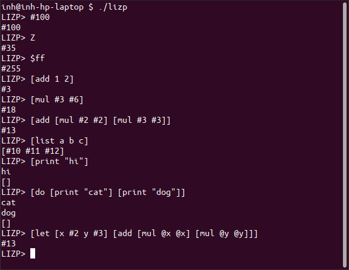

# Lizp

This is my own list processing programming language.



## Quick Start

To get right into the REPL you just need Make and a C compiler. Run this:

```shell
make lizp && ./lizp
```

## Literal values

There are only 2 data types: lists, and integers. The reader is not sensitive to letter case (it is case-insensitive).
Unless the invalid character appears in a number, any invalid characters are ignored.

* Lists: are delimited by square brackets: [...]
(which are the superior brackets because you don't need to press shift in order to type them)

* Integers: can be written with a sign, and in different bases (default base is base 36)
  * base 36, no sigil, any alphanumeric combination is legal 
  * base 10, `#` sigil
  * base 16, `$` sigil
  * base 2, `%` sigil

All integers can include `_` underscores to separate the digits anywhere for readability


